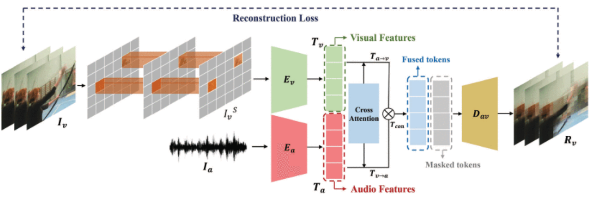

# AV-MaskEnhancer: Enhancing Video Representations through Audio-Visual Masked Autoencoder [ICTAI 2023]

**[Xingjian Diao*](https://xid32.github.io/), [Ming Cheng*](https://scholar.google.com/citations?user=MPyUxv4AAAAJ&hl=en), [Shitong Cheng](https://ieeexplore.ieee.org/author/37088529832)**

[Paper](https://ieeexplore.ieee.org/document/10356553) [(Arxiv)](https://ieeexplore.ieee.org/document/10356553)

**This work was developed from the Dartmouth College COSC 189 Video Understanding course.**



Learning high-quality video representation has shown significant applications in computer vision and remains challenging. Previous work based on mask autoencoders such as ImageMAE and VideoMAE has proven the effectiveness of learning representations in images and videos through reconstruction strategy in the visual modality. However, these models exhibit inherent limitations, particularly in scenarios where extracting features solely from the visual modality proves challenging, such as when dealing with low-resolution and blurry original videos. Based on this, we propose AV-MaskEnhancer for learning high-quality video representation by combining visual and audio information. Our approach addresses the challenge by demonstrating the complementary nature of audio and video features in cross-modality content. Moreover, our result of the video classification task on the UCF101 dataset outperforms the existing work and reaches the state-of-the-art, with a top-1 accuracy of 98.8% and a top-5 accuracy of 99.9%.

## Installation

To install and develop locally:

- PyTorch version >= 1.8.0
- Python version >= 3.6

```bash
git clone https://github.com/xid32/av-mae.git
cd videomae
```

------

## Dataset

We evaluate our AV-MAE on the commonly used video dataset - UCF101, which consists of over 13k (9.5k/3.5k train/val) video clips across 101 action classes, and is grouped into five types: Human-Object Interaction, Body-Motion Only, Human-Human Interaction, Playing Musical Instruments, and Sports. UCF101 contains web videos captured in uncontrolled settings, typically featuring camera movements, diverse lighting conditions, occasional partial occlusions, and occasional frames of low quality. This makes it an ideal resource for developing an advanced and robust encoder capable of getting high-quality video representations.

Download UCF101: [UCF101](https://www.crcv.ucf.edu/data/UCF101.php)

### Preprocessing

Please follow the instructions in [DATASET.md](videomae/DATASET.md) for data preparation.

## Experiments on UCF101

### Model Training

#### Video Reconstruction Training

```bash
bash scripts/ucf101/videomae_vit_base_patch16_224_tubemasking_ratio_0.75_epoch_3200/pretrain.sh
```

#### Video Classification Training from scratch

```bash
bash scripts/ucf101/videomae_vit_base_patch16_224_tubemasking_ratio_0.75_epoch_3200/finetune.sh
```

#### Video Classification Training using pre-trained model on the K400 dataset

```bash
bash scripts/ucf101/videomae_vit_base_patch16_224_tubemasking_ratio_0.75_epoch_3200/finetune_withpretrained.sh
```

### Loss Logs

File names inside the 'Loss Logs' folder:

- `cls_pretrain`
- `cls_scratch`
- `logs_modified_attention`
- `logs_without_attention_original`
- `original`

### Sample Videos Generated

Folder names that contain our video reconstruction samples:

- `VideoMAE_Original`
- `AV-MAE_withoutAtt`
- `AV-MAE`

## Citation

If you find the repository useful for your work, please cite our paper.

```
@inproceedings{diao2023av,
  title={AV-MaskEnhancer: Enhancing Video Representations through Audio-Visual Masked Autoencoder},
  author={Diao, Xingjian and Cheng, Ming and Cheng, Shitong},
  booktitle={2023 IEEE 35th International Conference on Tools with Artificial Intelligence (ICTAI)},
  pages={354--360},
  year={2023},
  organization={IEEE}
}
```